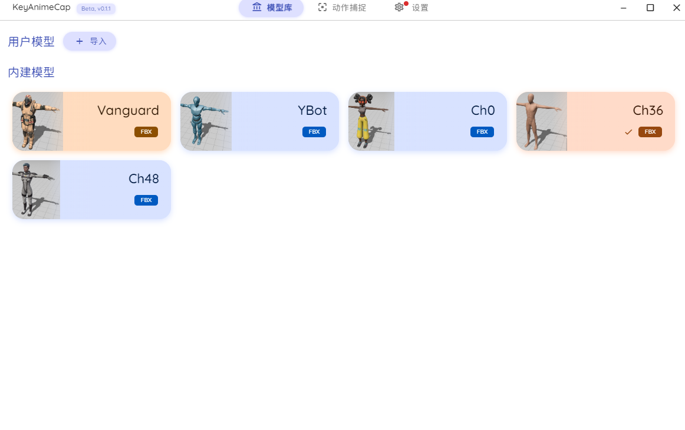
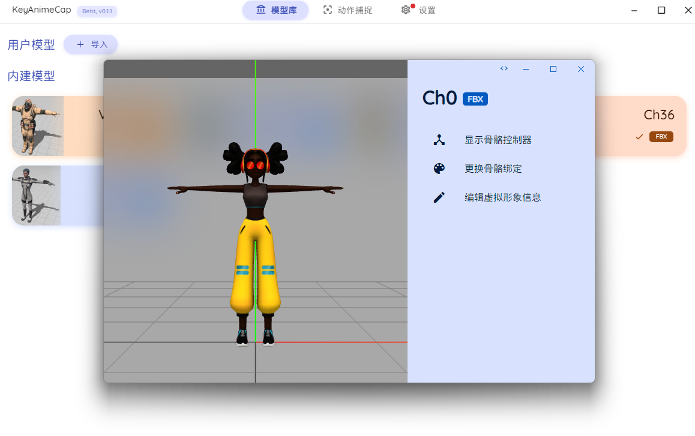
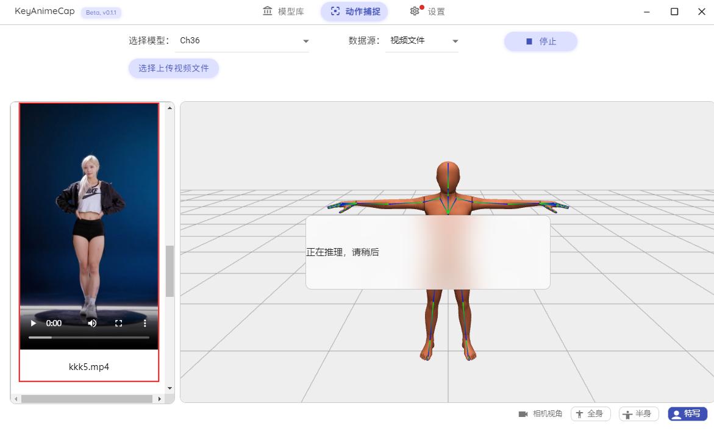

<h1 align="center">
KeyAnimeCap
</h1>

<p align="center">

</p>

跨平台的视频动作捕捉软件
采用前后端分离的模式，此为前端，进行用户交互，驱动后端及展示。


### Features

- 模型管理，可管理多个模型，用户可导入自定义模型
- 模型查看器，可以查看和修改模型骨骼信息
- 视频管理
  - 可以获取后端数据库中的视频数据，并展现在左侧list中
  - 可上传自定义视频
  - 点击左侧视频高亮，作为本次视频动捕的数据源
- 视频动作捕捉
  - 可选择库内任意模型作为动画展示模型
  - 点击开始，向后端发送指令，等待动捕数据返回
- 动画展示
  - 重映射：前端内进行bvh动捕数据和3D模型骨骼的重映射
  - 右侧小窗播放本次数据源 
  - 在3D模型上展示动画

### 展示
#### 模型界面

|||
|---------------|-----------------|


#### 动捕界面
- 选择视频，开始动捕
- 后端推理结果可视化
    <video controls width="800">
  <source src="screenshots/dancingRes1.MP4" type="video/mp4">
  后端推理结果可视化
    </video>
- 动捕结果展示1
- 动捕结果展示2  


### 如何使用


#### 使用源代码运行 (需要最新版 Node.js):

```shell
git clone https://github.com/GianKey/KeyAnimeCap.git
cd KeyAnimeCap
npm i
npm run start
```


